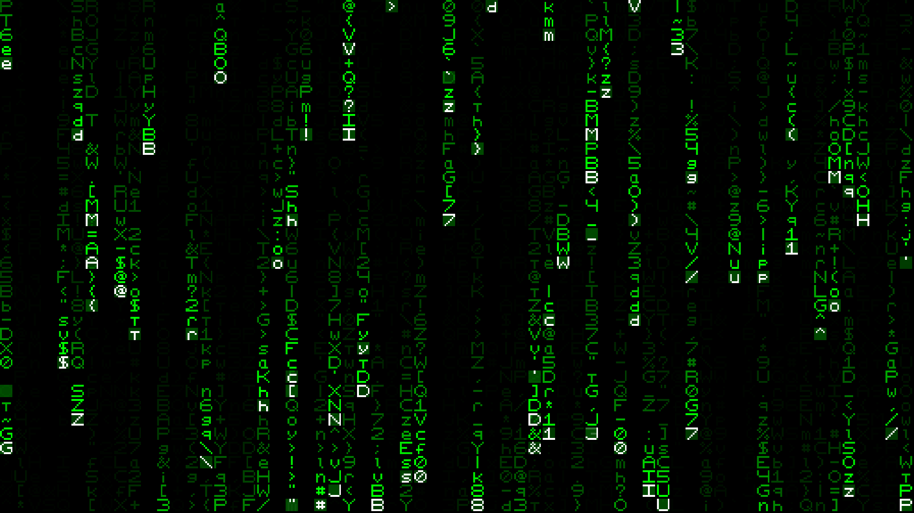
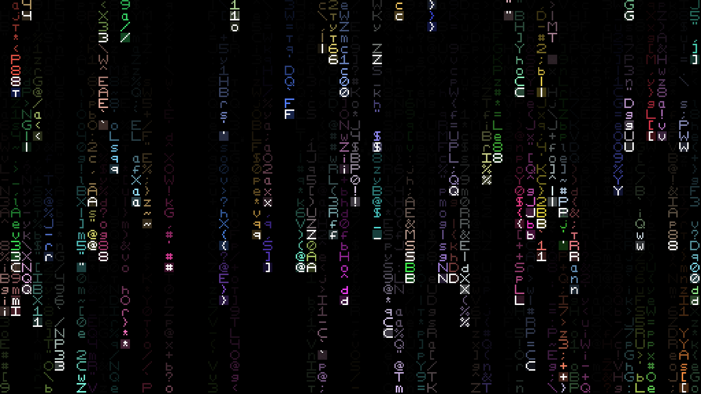
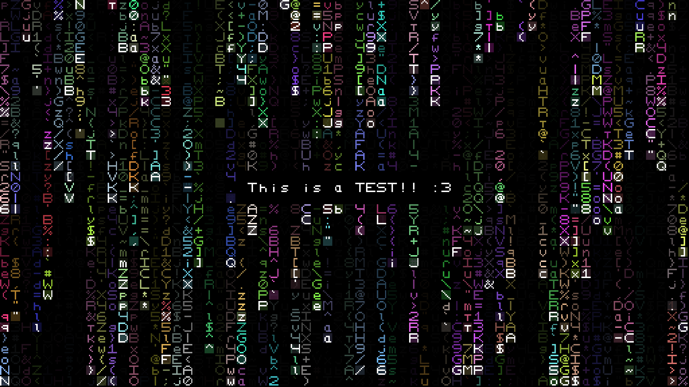

```
"LoTrix" - Lofi Matrix Effect

Decided to make this fun little thing just to learn a bit of C++ and Raylib.
Still a noob at it but I will get there (eventually).
Font made by me.
                                                _.---> Default is false (can only be set to true).
- It takes 4 arguments atm:                    /
    ./LoTrix [width] [height] [max_amount] [rainbow] [message] ---> Default is empty. Use "" to type a whole message, otherwise just type the letter or word you want.
                 \       \          \_.-> Default is the highest value between width and height divided by 4 (128 / 4 = 32).
                  '-------'---> Default is 128x128.
- Keybinds:
    KEY_SPACE/KEY_P ---> Pause/unpause.
    KEY_F -------------> Toggle fullscreen.
```


```
512x288, 128 [max_amount] on a 1920x1080 screen (35MB~).
Rainbow -> false:
```

```
512x288, 128 [max_amount] on a 1920x1080 screen (35MB~).
Rainbow -> true:
```

```
512x288, 256 [max_amount] on a 1920x1080 screen (38MB~).
Message test preview.
```

