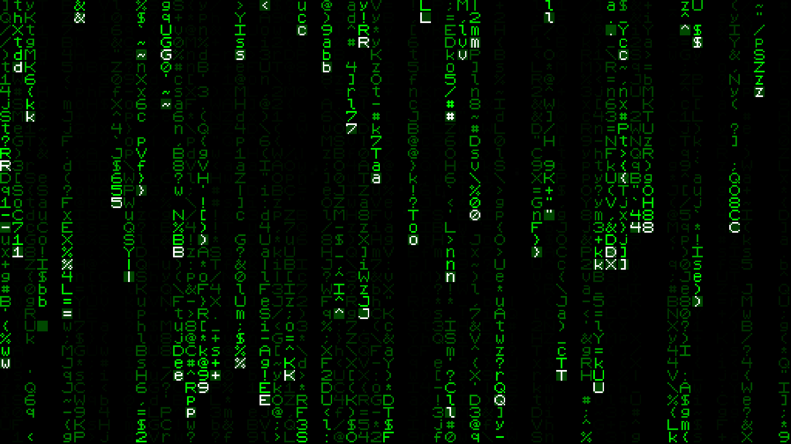
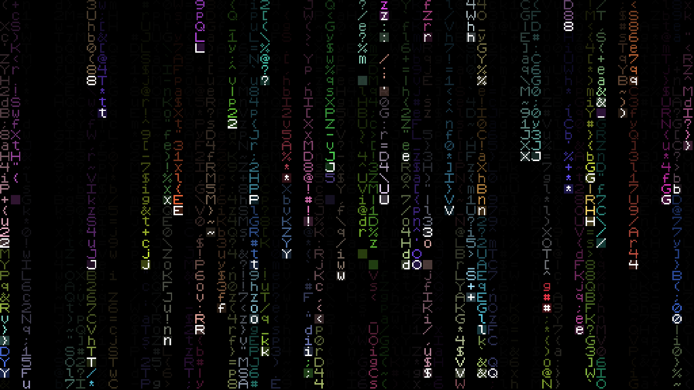
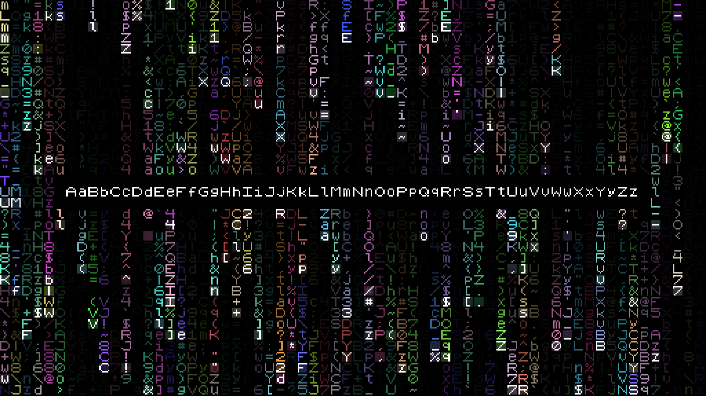

<h1 align="center">Lotrix</h1>

 Lofi Matrix effect written in C + Raylib. Font made by me.

Lotrix at 512x288. (35MB~)

## Features
- Arguments & defaults:
  - `./lotrix [width] [height] [max_amount] [rainbow] [message]`
    - `[width]/[height]`: Width and height it'll be drawn at. Default is 128 by 128.
    - `[max_amount]`: Maximum amount of characters that will be created. Default is the highest value between width and height divided by 4 (128 / 4 = 32).
    - `[rainbow]`: Fun colors. Default is set to false.
    - `[message]`: Display a character or a whole message on the screen using "". Default is empty.
- Keybinds:
  - `KEY_SPACE/KEY_P` - Pause/unpause.
  - `KEY_F` - Toggle fullscreen.

## Demos

Lotrix at 512x288 & rainbow set to true. (35MB~)

Lotrix at 512x288, 256 characters, rainbow set to true & displaying a message. (38MB~)

